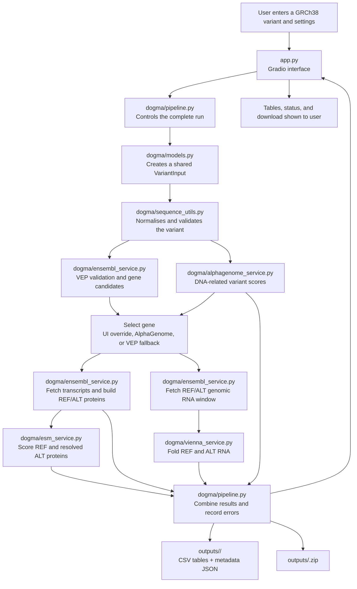

# DOGMA Gradio pipeline structure

**Date:** 12 July 2026  
**Purpose:** A simple map of how the files inside `dogma_gradio/` work together
to run the DNA → RNA → protein pipeline.

## Simple schematic

## How the files relate

### 1. `app.py` — input and display

This is the front end. It builds the Gradio controls, collects the user's
variant and analysis settings, and calls `run_dogma_pipeline()` from
`dogma/pipeline.py`. When the pipeline finishes, `app.py` displays its status,
tables, and ZIP download.

It imports the available AlphaGenome track choices from
`alphagenome_service.py` and ESM2 model choices from `esm_service.py`, so the UI
options stay consistent with the analysis code.

### 2. `dogma/pipeline.py` — coordinator

This is the central controller and the only file that joins all analysis
services. It runs the following sequence:

1. Create and validate the variant.
2. Ask Ensembl VEP to verify it and identify candidate genes.
3. Run the selected AlphaGenome scorers.
4. Select a gene using the optional UI override first, AlphaGenome second, and
   an Ensembl VEP candidate third.
5. Retrieve the selected gene's translated Ensembl isoforms.
6. Run ViennaRNA on a local REF/ALT genomic window.
7. Run ESM2 on reference and safely reconstructed alternate proteins.
8. Save all tables and metadata, make a ZIP, and return the results to `app.py`.

Each major service is protected separately. If one analysis fails, the pipeline
records the error and preserves results from stages that succeeded.

### 3. Shared files

- `dogma/models.py` defines `VariantInput`, the common variant object passed
  between services.
- `dogma/sequence_utils.py` contains shared validation and sequence operations:
  chromosome normalisation, reverse complementation, DNA-to-RNA conversion,
  transcript-strand orientation, and CDS translation.
- `dogma/__init__.py` marks `dogma/` as a Python package so its modules can be
  imported.

### 4. Analysis services

- `dogma/alphagenome_service.py` handles the DNA/regulatory branch. It runs the
  requested AlphaGenome scorers, filters and sorts their results, and can
  suggest the strongest protein-coding gene.
- `dogma/ensembl_service.py` supports both RNA and protein branches. It calls
  Ensembl VEP, verifies the GRCh38 reference allele, fetches the RNA genomic
  window, retrieves gene transcripts and proteins, and reconstructs alternate
  proteins only for variants that map safely to a CDS.
- `dogma/vienna_service.py` receives the Ensembl genomic window, places it in
  transcript orientation, converts DNA to RNA, folds REF and ALT with
  ViennaRNA, and calculates the MFE difference.
- `dogma/esm_service.py` receives the Ensembl isoform table, removes duplicate
  sequences, scores eligible REF and ALT proteins with ESM2, and calculates
  alternate-minus-reference likelihood differences.

The ViennaRNA and ESM2 services call tools supplied by the separately installed
`proto_tools` package.

### 5. Supporting files and folders

- `requirements.txt` lists the public Python packages needed by the app.
- `tests/test_sequence_utils.py` tests important shared sequence behaviour.
- `outputs/` stores a timestamped directory and ZIP archive for every run.
- `README.md` contains installation instructions, a test case, biological
  interpretation, outputs, and limitations.

## Pipeline outputs

For each run, `pipeline.py` creates:

- `dogma_summary.csv` — one-row overview of the run;
- `alphagenome_scores.csv` — DNA/regulatory scores;
- `viennarna_scores.csv` — REF and ALT RNA folding results;
- `ensembl_isoforms.csv` — transcript and protein mapping;
- `protein_sequences.csv` — REF and resolvable ALT protein sequences;
- `esm2_scores.csv` — ESM2 protein scores and differences;
- `run_metadata.json` — inputs, statuses, errors, and interpretation notes;
- a ZIP archive containing the complete run.

## One-sentence summary

`app.py` gathers inputs, `pipeline.py` coordinates the work, the service files
perform each biological analysis, shared files keep the data consistent, and
the completed tables return to the UI and `outputs/`.
